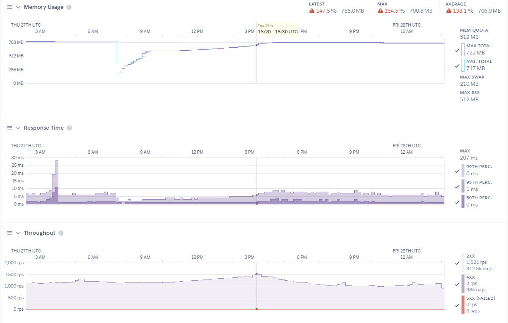
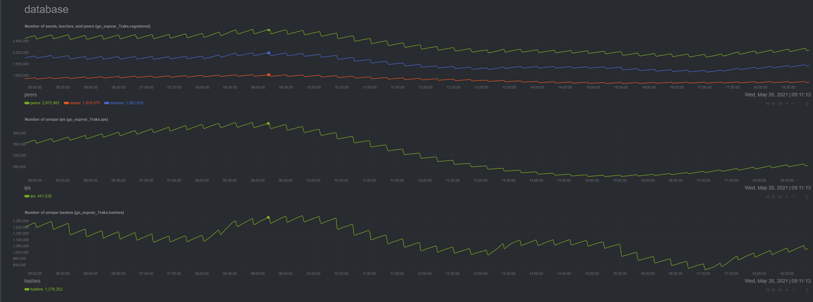
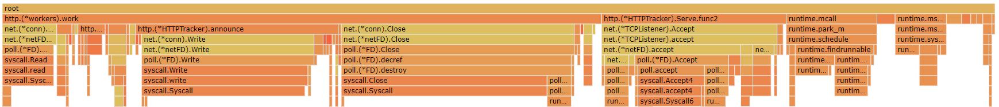

# Trakx

Performance focused BitTorrent tracker supporting HTTP, UDP, IPv4 and IPv6.

- [Trakx](#trakx)
  - [❤️‍🔥 Instances](#️-instances)
  - [🚀 Install](#-install)
  - [🧰 CLI](#-cli)
  - [🔧 Configuration](#-configuration)
    - [Configuration file](#configuration-file)
    - [Database backups](#database-backups)
    - [Default configuration \& webserver files](#default-configuration--webserver-files)
    - [Binding to privileged ports](#binding-to-privileged-ports)
    - [Netdata setup](#netdata-setup)
    - [Build Customization](#build-customization)
      - [**Performance**](#performance)
  - [📈 Performance](#-performance)

## ❤️‍🔥 Instances

Try Trakx for yourself! These instances are hosted on Oracles always free tier.

| Status       | Protocol  | Address                             |
|--------------|-----------|-------------------------------------|
| ✅Ok         | IPv4 UDP  | `udp://u4.trakx.crim.ist:1337`      |
| ✅Ok         | IPv6 UDP  | `udp://u6.trakx.crim.ist:1337`      |
| ✅Ok         | IPv4 HTTP | `http://h4.trakx.crim.ist/announce` |
| ✅Ok         | IPv6 HTTP | `http://h6.trakx.crim.ist/announce` |

## 🚀 Install

Go 1.21+ required.

```sh
git clone https://github.com/crimist/trakx && cd trakx

# install to go bin
go install ./cmd/trakx
trakx status # generates configuration

# or build
go build -o trakx ./cmd/trakx
./trakx status # generates configuration
```

See [configuration](#configuration) and [netdata setup](#netdata-setup).

## 🧰 CLI

Common commands:

```sh
trakx run           # foreground
trakx start         # background
trakx stop          # stop daemon
trakx restart       # restart daemon
trakx status        # status check
trakx logs -f       # follow latest log file
trakx pid show      # inspect pid file
trakx config path   # show config path
```

## 🔧 Configuration

### Configuration file

The configuration file can be found at `~/.config/trakx/trakx.yaml`.
You'll have to run trakx at least once (for example `trakx status`) to generate this file.

Config settings can be overwritten with environment variables:

```sh
$ cat trakx.yaml
...
loglevel = error
...

$ TRAKX_LOGLEVEL=DEBUG trakx run
2022-01-16T19:52:25.627-0800    DEBUG   Debug level enabled, debug panics are on
...
```

Trakx attempts to load the config file from the following directories in order:

* `.`
* `~/.config/trakx/`

### Database backups

Trakx persists the in-memory database to a binary snapshot at `db.backup.path`.
`backup export` requests a fresh snapshot from the running daemon when available,
and otherwise streams the on-disk backup file.
`backup import` validates snapshots before replacing the on-disk backup.
You can stream the snapshot bytes to external storage using:

```sh
trakx backup export > trakx.snapshot
cat trakx.snapshot | trakx backup import
```

### Default configuration & webserver files

You can modify the default configuration and files served by the webserver in the `internal/config/embedded/` folder.

**NOTE:** Trakx webserver will only serve files at their full path. `dmca` will 404, `dmca.html` will 200.

### Binding to privileged ports

To bind to privileged ports I recommend using `CAP_NET_BIND_SERVICE`. More information can be found [here](https://stackoverflow.com/a/414258/6389542).

```sh
$ sudo setcap 'cap_net_bind_service=+ep' ./trakx
$ TRAKX_TRACKER_HTTP_PORT=80 ./trakx run
2022-04-05T16:18:05.847-0700    INFO    HTTP tracker enabled    {"port": 80}
```

### Netdata setup

**Warning:** `install.sh` will overwrite `go_expvar.conf`. If you are using other expvar programs with netdata manually merge the two files.

* Run `/etc/netdata/edit-config python.d.conf`, change `go_expvar` to `yes`.
* Customize the url in `configs/netdata/expvar.conf` if needed.
* Install netdata plugins with `cd configs/netdata; ./install.sh`.

### Build Customization

Trakx takes advantage of Go's build tags to target different use cases.

#### **Performance**

The `fast` tag will build Trakx without IP, seed, and leech metrics which will reduce cpu and memory usage.

## 📈 Performance

The following metrics were collected on Heroku free tier running an HTTP tracker with the `fast` tag disabled.

Heroku dashboard:



Database stats:



Flamegraph:



Trakx has been optimized to use a little CPU time as possible. In most cases, almost all CPU time will be spent handing (negotiating/send/recv) connections, especially for TCP (HTTP).

Trakx has also been optimized to use minimal memory and is mostly limited by the go GC. In this example the GC runs every 2 minutes ([the forced GC period](https://github.com/golang/go/blob/895b7c85addfffe19b66d8ca71c31799d6e55990/src/runtime/proc.go#L4481-L4486)) at this level of traffic. The `inuse_space` delta from GC is 7.5% meaning this collection frequency would be sustained at `GOGC=8`.
